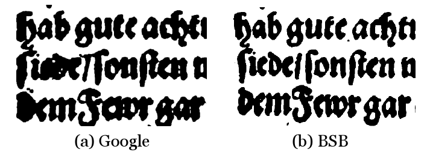
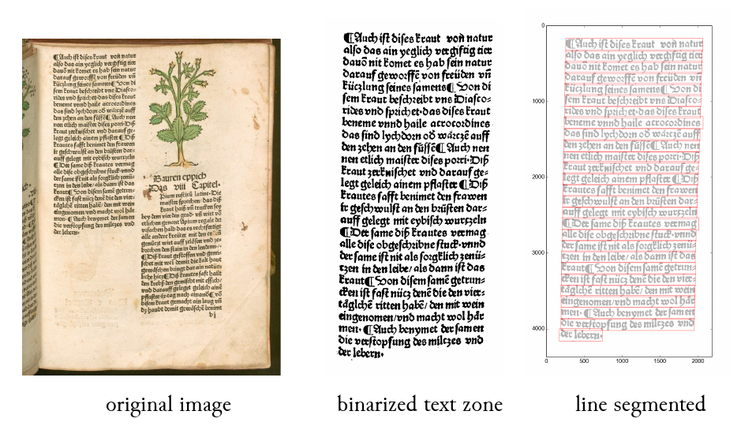
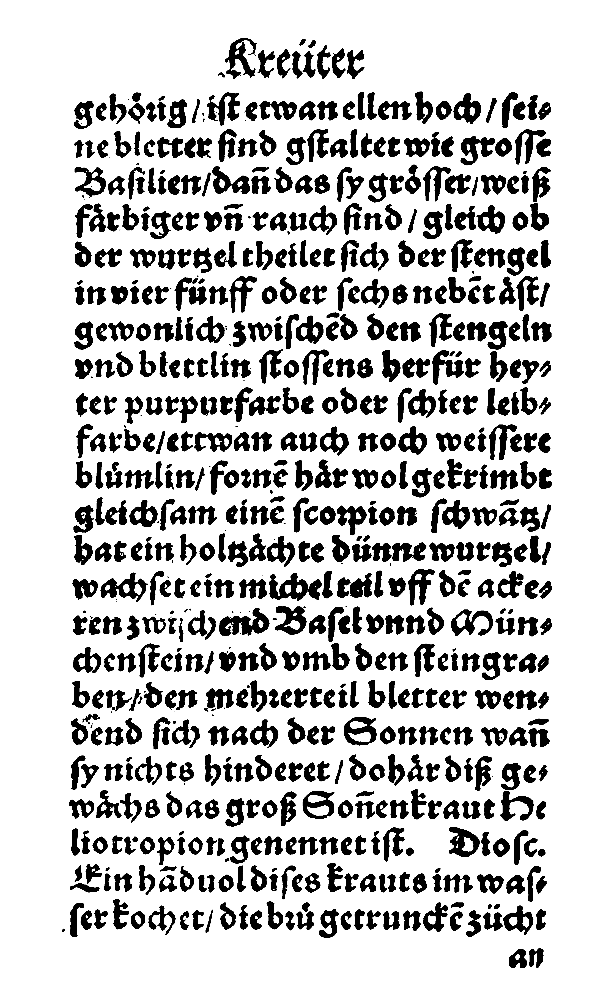
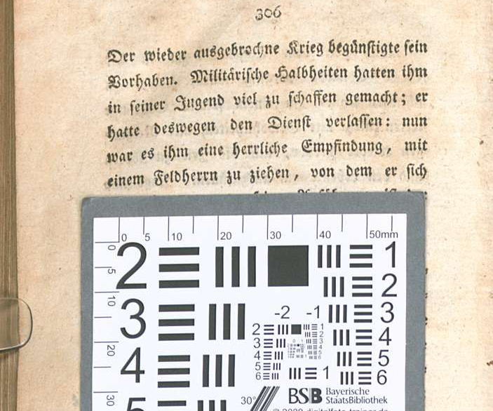
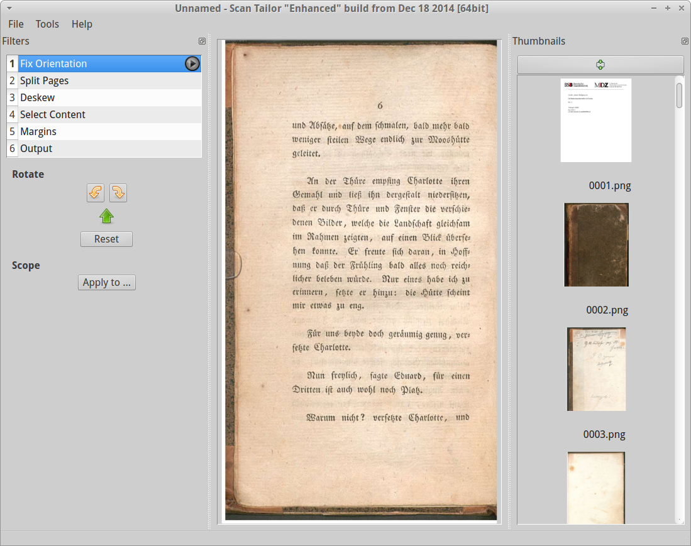
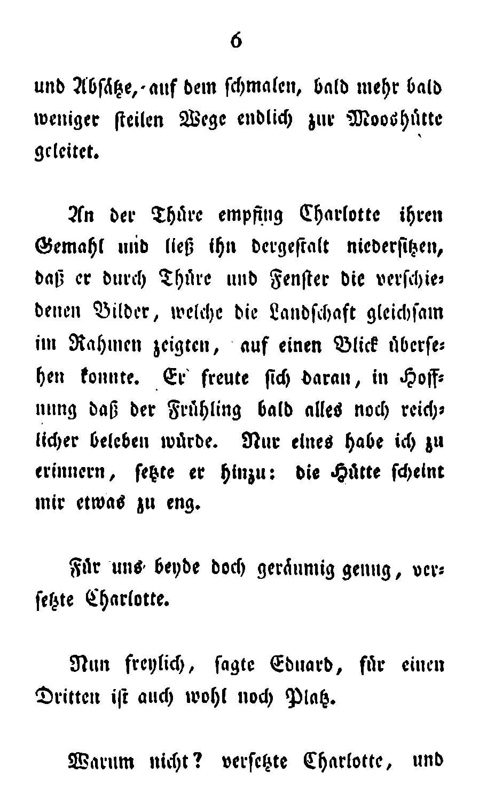

% Module 2  
Image acquisition & preprocessing
% Uwe Springmann
% 2015-09-14

## Motivation

* remember: the complete OCR workflow consists of several steps:

    1. image acquisition
    2. preprocessing
    3. (ground truth production, model training)
    4. recognition
    5. evaluation
    6. postprocessing: annotation, error correction, tagging, ...
    
* "a chain is only as strong as its weakest link":
    
    bad images/preprocessing will severely limit the quality of your end result

* trade-off: fast result against quality result (requires some manual processing)

* make an informed decision based on your objectives

# Image acquisition

## Where to look for digitized books

* look for scans at [HathiTrust][hathi], [archive.org][archive], [Europeana][europeana], [The European Library][eurolib], [DDB][ddb], [Wikisource][wikisource], [BSB][bsb], or [Google books][google-books]

* try to find the best scan (Google books are often the worst); larger file sizes point to higher resolution 

* especially good scans can be found in DFG-funded projects ([VD16][vd16], [VD17][vd17], [VD18][vd18])

* if you cannot find a scan:
    + have it scanned from an institution (can be expensive)
    + your local research library may be able to help you
    + or do-it-yourself:
        - procure your own copy, take the pages apart and scan them
        - scan either in color or (at least) grayscale
        - resolution: preferably 300-400 dpi; higher resolution may not be better\
         (connected components in letter shapes may fall apart)
    + the [DFG digitisation guidelines][dfg-digit] may be helpful 

[hathi]: https://www.hathitrust.org/
[archive]: https://archive.org/details/texts
[europeana]: http://www.europeana.eu/portal/
[eurolib]: http://www.theeuropeanlibrary.org/tel4/
[ddb]: https://www.deutsche-digitale-bibliothek.de/
[wikisource]: https://de.wikisource.org/wiki/Wikisource:Bibliographieren
[bsb]: http://www.digitale-sammlungen.de
[google-books]: https://books.google.com/
[vd16]: http://www.vd16.de/
[vd17]: http://www.vd17.de/
[vd18]: http://vd18.de/
[dfg-digit]: http://www.dfg.de/formulare/12_151/


## Some tips for image acquisition

* often books found at Google are also available at a higher resolution at BSB (search BSB first)

* use the [BSB OPACplus catalog][opacplus] to search for volumes (results can be filtered for online resources)

* at [archive.org][archive], download "single page processed JP2 zip" file rather than pdf or djvu files (the latter are downgraded in resolution)

* avoid binarized images, do your own binarization later on

* publicly available images tend to be downsized 150 dpi "service copies" (pdf or jgp); you can ask for higher resolution original png of tiff images

* you can still OCR 150 dpi material, but if the results are not good enough for you, get 300 dpi scans before you do heavy postcorrection

[opacplus]: https://www.bsb-muenchen.de/en/catalogues-databases/all-subject-areas-catalogues-and-databases/opacplus/


## Effect of image quality on recognition

\


* the same scan with lower (Google) and higher (BSB) resolution
* after model training, the accuracy on test pages is 94% (Google) and 97% (BSB)

# Preprocessing

## Preprocessing tasks

* preprocessing consists of (some of) the following tasks:
    + splitting: split double-side images into single pages, or several columns into single-column images
    + cropping: get rid of (black) boundaries
    + deskewing: bring image to horizontal orientation
    + dewarping: "flatten" image, if scanned from warped pages
    + despeckle: noise reduction, suppress black spots ("speckles")
    + binarization: separate signal (characters, black) from noise (background, white)
    + zoning: separate text zones from non-text (images, graphs etc.); separate semantically different text zones (running heads, page numbers, footnotes, columns, ...)
    + line segment: cut text zones in single text lines

* all OCR engines have some kind of built-in preprocessing facility

* however, for optimal results it is often better to do some manual tool-assisted preprocessing


## Example: Gart der Gesundheit (printing of 1487)

[Johann Wonnecke von Kaub (Johannes von Cuba), Gart der Gesundheit (1487)][gdg]

[gdg]: http://daten.digitale-sammlungen.de/bsb00048197/image_17

\


## Effect of preprocessing on recognition (Bodenstein 1557)

\colA{3cm}

\

\colB{3cm}

\

\colEnd

Character accuracy:
                                |
OCR engine                       |  orig.     | prepr.
---------------------------------|------------|-------
Tesseract (Fraktur)              |      35%   |   71%
Abbyy (Fraktur + hist. lexicon)  |      78%   |   79%


## Preparing the document

* to begin preprocessing, we need single page images in tif or png format

* often you will start from images contained in a single large pdf file or in other formats (jpg, JP2)

* document splitting and format conversion can be done by these open source tools:

    + pdf splitting: [PDFtk][pdftk] (Linux: pdftk package)
    + format conversion (choose one of these for batch processing):
        - `convert` from [ImageMagick][imagemagick] suite
        - `convert` from [GraphicsMagick][graphicsmagick] suite
        - `pdftoppm, pdfimages` from [Xpdf][xpdf] tools, or (Linux) from poppler-utils package
        
* if your image is blurred, has an unusual perspective, etc., you can get some help on image preprocessing here:
    + Fred's ImageMagick Scripts (ready-made scripts for a wide variety of tasks)
    + Dan Bloomberg's [leptonica][leptonica] package (look at the [dewarping][lept-dewarp] example!)
   
* further preprocessing will be done by [ScanTailor][scantailor]

[scantailor]: http://scantailor.org/   
[pdftk]: https://www.pdflabs.com/tools/pdftk-the-pdf-toolkit/    
[imagemagick]: www.imagemagick.org
[graphicsmagick]: http://www.graphicsmagick.org
[xpdf]: http://www.foolabs.com/xpdf/download.html
[fred]: http://www.fmwconcepts.com/imagemagick/
[leptonica]: http://www.leptonica.com
[lept-dewarp]: http://www.leptonica.com/dewarping.html


## Example: Goethe, Wahlverwandtschaften (1809)

* available at BSB: [Wahlverwandtschaften, vol. 1][wahlverw]

* download and rename as `goethe.pdf`

* the following commands assume:
    + a Linux / MacOS system, but similar tools exist for Windows (see above)
    + that you have installed the necessary software (for Debian-flavored Linux variants, this is as easy as step 0)
    
* step 0: install software (Debian-flavored Linux)
```bash
        $ sudo apt-get install pdftk poppler-utils \
            imagemagick scantailor
```

* step 1: split pdf in single pages
```bash
        $ mkdir pdf
        $ pdftk goethe.pdf burst output pdf/%04d.pdf
```
        
[wahlverw]: http://daten.digitale-sammlungen.de/bsb00087891/image_5

## Example (Goethe): pixel size, convert to png

* step 2: find pixel size of images in pdf 
    + for scanned books, pdf is just a container format for included images
    + as a vector format, a pdf does not have a pixel size                    
```bash
            $ pdfimages -list 0100.pdf
            page   num  type   width height color comp bpc  enc
            ---------------------------------------------------
               1     0 image     714  1283  rgb     3   8  jpeg
```        
    + the included jpeg image has 714x1283 pixels
    + for jpeg images in pdf, step 1 is just `pdfimages -j gdg.pdf gdg`

* step 3: convert pdf (or other format) to png
```bash
        $ mkdir png
        $ cd pdf
        $ for f in pdf; do convert "$i" "${i/.pdf/.png]"; done
        $ mv *.png ../png
```
        
## Example (Goethe): resolution
        
* step 4: find resolution of image (needed as input for ScanTailor)

    + sometimes the scanning resolution (dpi) is given in metadata (archive.org)
    
    + if you know the physical size of your page: 
    
        divide pixel height (or width) by height (or width) in inch (1 in = 2.54 cm)
    
    + png image has 714x1283 pixels (same as jpeg; 
        
        otherwise use convert with --density option)
    
    + take pixel measurements from png image with ruler (last page) at 100% image size 
        
        (okular or other viewer)
    
    + rule of thumb: height of 6 text lines ca. 1 inch
    
    + pixels per inch (ppi, used in imaging) correspond to dots per inch (dpi, used in printing)

## Example (Goethe): resolution (cont'd)

in DFG scans, a ruler was scanned with one of the last pages:  
    measure ruler size in pixels

\colA{5cm}
        
\

\colB{7cm}

* here: 
    355 pixels/(5/2.54) inch = 180 ppi

* not ideal resolution, but this is what we got

* resolution of 150 .. 180 dpi to be expected for downloadable files (lower size saves bandwidth)

\colEnd

## Example (Goethe): ScanTailor

Convert png image into binarized tif using ScanTailor

\colA{6.5cm}

\
ScanTailor with png of original image

\colB{3cm}

\
tif image as result of preprocessing

\colEnd


## Example (Goethe): recognition compared

character vs. word accuracy in %:


|              |    characters|              |         words|              |
|--------------|--------------|--------------|--------------|--------------|
|    OCR engine|           png|           tif|           png|           tif|
|     Tesseract|         86.42|         96.06|         68.18|         84.55|
|       OCRopus|         95.33|         96.06|         82.73|         89.09|
|   Abbyy FR 11|         96.79|         95.33|         92.73|         91.82|


## Conclusion

* for 19th century Fraktur printings, ca. 95% character accuracy can be achieved
by any engine (without training)

* separate preprocessing makes a difference for character (Tesseract) and word accuracies (Tesseract, OCRopus)

* Abbyy has very good automatic preprocessing, separate preprocessing is unnecessary

