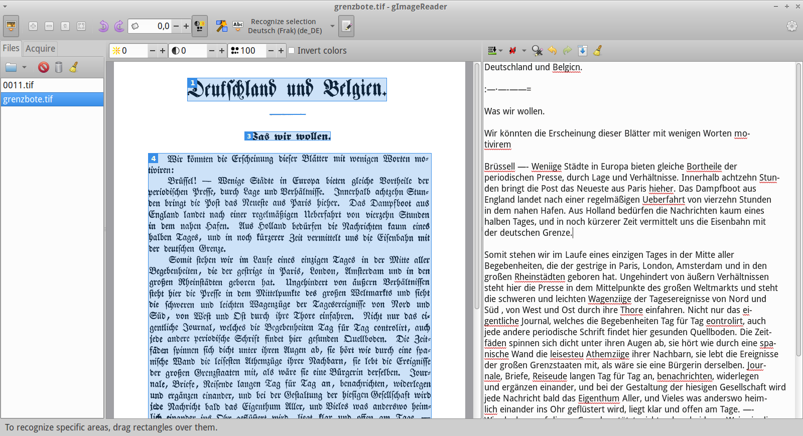

% Module 7  
  Using Tesseract: Practice
% Uwe Springmann
% 2015-09-15

## Practice session: Overview
* download the data for this session

* OCR some pages

* use a GUI for OCR and postcorrection

* compare the effect of different traineddata files

## OCR some page images

* the downloaded data contain the following images:
    + goethe.tif (Goethe 1809, Wahlverwandtschaften)
    + grenzboten.tif (Grenzboten 1841)
    + latin.tif (Hobbes 1668, Leviathan)
    + greek.tif (Zonaras 1870, Epitome)
    
* OCR the pages with the following commands from the data directory:
```bash
tesseract goethe.tif goethe -l deu-frak
tesseract latin.tif latin -l lat
tesseract greek.tif greek -l grc
```

* the Tesseract delivered lat.traineddata file is not as good as\
the one by [Ryan Baumann][ryanlat]

* you may just as well use one of the GUI programs mentioned in   
Module 0: Software
    
* compare with ground truth, e.g.
```bash
    ocrevalutf8 accuracy somefile.gt.txt somefile.txt | more
```

[ryanlat]: https://github.com/ryanfb/latinocr-lat/releases/download/v0.2.2/lat.traineddata

## Using a GUI: gImageReader

* download and install gImageReader ([instruction][gimage])

* load and recognize an image

* correct text in right pane (spellchecking via installed dictionary)
\


[gimage]: http://ancientgreekocr.org/windows.html

## Training Tesseract

* the good news: Tesseract is fully trainable (typeface training, inclusion of wordlists)

* but the training procedure is quite involved ([description][tesstrain])

* there exist a number of training tools, but all of them build synthetic images from text using available computer fonts
    + works well with typefaces for which computer fonts are a good representation
    + does not work very well for early printings
    + OCRopus only succeeds because we train from real images
    + there is no description how to train Tesseract from real images
    
* [EMOP][emop] tried a middle path: building an artificial font by cutting out glyphs from page images, then using the synthetic method
    + [training files][emophist] for these historical fonts are on github
    + they only contain English glyphs (no umlauts) and English wordlists

[tesstrain]: https://github.com/tesseract-ocr/tesseract/wiki/TrainingTesseract
[emop]: http://emop.tamu.edu/
[emophist]: https://github.com/Early-Modern-OCR/TesseractTraining/tree/master/FontTraining

## Compare different traineddata files    

* OCR the latin images with default settings, with EMOP Antiqua fonts, with Baumann's latin training:
```bash
    tesseract latin.tif latin.baseline 
    tesseract latin.tif latin.emop --tessdata-dir . -l RI5Combo-R8-D2b
    tesseract latin.tif latin.baum --tessdata-dir . -l lat
```

* compare the results: the first two use English language data, the middle one artificial historical fonts, the last one computer fonts but a Latin dictonary.

* lat.traineddata does recognize `ſ,æ,œ`, but renders them as `s,ae,oe`. Evaluate again against lat.gtnorm.txt.

